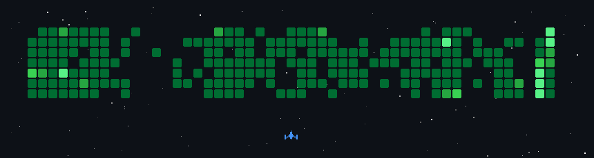

# Hey, I’m Julian

**`Lead Product Designer bridging UX & Code`**

👨‍💻 **Contributor** — 2,000+ commits in the past year across design-to-code tools and UI frameworks.  
🚀 **Builder** — Created AI-driven workflows that turn Figma layouts into working code with shadcn/ui + Storybook.  
🧩 **Design Systems Guy** — Experienced in UX, scalable design tokens, and component libraries.  
🌍 **Cross-Disciplinary** — Bridging UX & Code to ship fast, user-centered digital products.

  

#

### Latest YouTube Videos

   

       
       
      
   

<!-- BEGIN YOUTUBE-CARDS -->

<!-- END YOUTUBE-CARDS -->

#

### Design Tools

### Codding Tools

### APIs

### Hosting

   

### Component Libraries

   

### Tech Stack

              

#

### Stats

#

[website]: https://www.julianoczkowski.com
[youtube]: https://youtube.com/@jules-ai-lab
